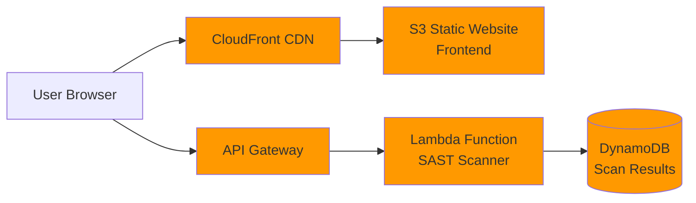
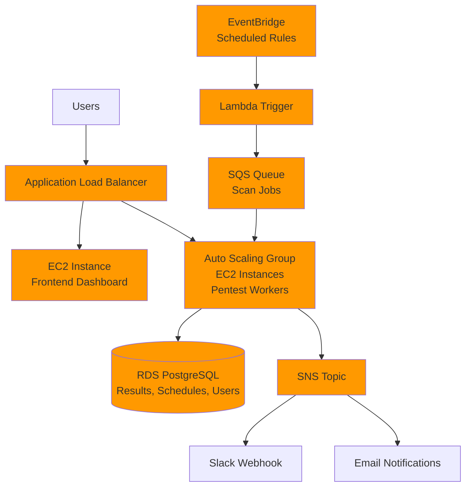
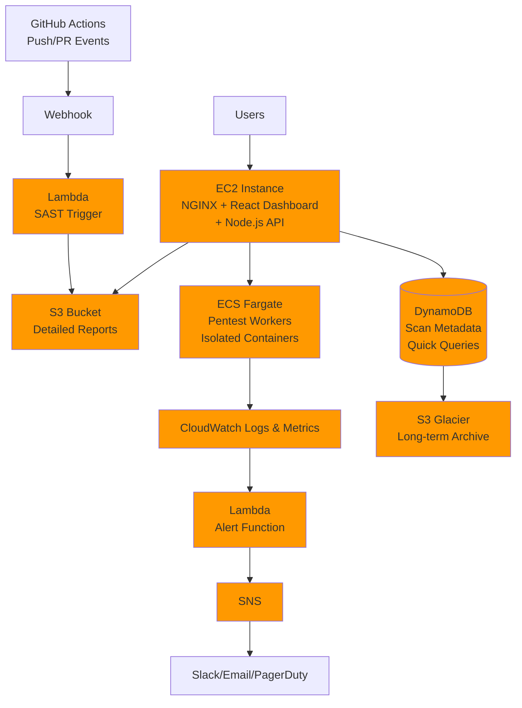
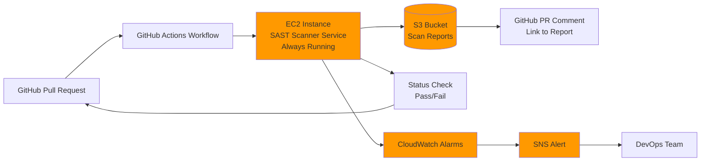

# CS6620 Cloud Computing - Spring 2026
# Semester Project: Cloud Security Platform

## Project Overview

This semester, you will design and deploy a cloud-based security platform on Amazon Web Services (AWS). You are provided with two foundational security tools:

- **SAST Scanner**: A Static Application Security Testing tool that analyzes source code for vulnerabilities
- **API Penetration Tester**: A dynamic testing tool that probes running APIs for security issues

**Your challenge:** Design a cloud architecture that deploys these tools (one or both) in a way that solves a real problem. You will propose your own architecture, choose appropriate AWS services, and justify your design decisions.

This is not a "follow the recipe" project. You will make architectural decisions, justify your technology choices, and build a system that demonstrates your understanding of cloud computing principles.

---

## Understanding Application Security Testing

### What is SAST (Static Application Security Testing)?

**In simple terms:** SAST tools read source code without running it, looking for patterns that indicate security problems.

**What the provided tool does:**
- Scans JavaScript source code files
- Detects 10 types of vulnerabilities:
  - Hardcoded secrets (API keys, passwords, tokens)
  - SQL injection risks
  - NoSQL injection risks
  - Cross-site scripting (XSS) vulnerabilities
  - Path traversal issues
  - Insecure functions (eval, exec)
  - Hardcoded IP addresses
  - Weak randomness (using Math.random() for security)
  - Sensitive data in logs
  - Weak cryptography (MD5, SHA1)
- Returns detailed reports with line numbers, severity levels, and recommendations

**How it works:**
```
Input: JavaScript source code (as text, file, or entire directory)
Process: Pattern matching using regular expressions
Output: JSON report with vulnerabilities found
```

**Real-world use cases:**
- Scan code before committing to Git
- Run automatically in CI/CD pipelines (GitHub Actions)
- Audit codebases for security issues
- Generate reports for security teams
- Track vulnerability trends over time

**Provided API endpoints:**
- `POST /scan/code` - Scan code snippet
- `POST /scan/file` - Scan a file path
- `POST /scan/directory` - Scan entire directory
- `GET /vulnerabilities` - List detected vulnerability types
- `GET /health` - Health check

**Try it locally:**
```bash
cd sast/backend
npm install
npm start
# Server runs on http://localhost:3000

# Test it
curl -X POST http://localhost:3000/scan/code \
  -H "Content-Type: application/json" \
  -d '{"code": "const password = \"admin123\";"}'
```

---

### What is API Penetration Testing?

**In simple terms:** Pentesting tools interact with running applications to find vulnerabilities by trying to exploit them.

**What the provided tool does:**
- Tests live APIs for security vulnerabilities
- Runs 6 types of security tests:
  - Missing authentication checks
  - SQL injection vulnerabilities
  - NoSQL injection vulnerabilities
  - Rate limiting (brute force protection)
  - Security headers (X-Frame-Options, CSP, etc.)
  - Sensitive data exposure
- Analyzes responses to determine if vulnerabilities exist
- Returns pass/fail/warning status for each test

**How it works:**
```
Input: Target API URL
Process: Send test requests with various payloads, analyze responses
Output: JSON report with test results and findings
```

**Real-world use cases:**
- Regular security scanning of production APIs
- Scheduled monitoring (hourly, daily, weekly)
- Alert teams when new vulnerabilities appear
- Compliance testing (security audits)
- Compare security posture over time

**Provided API endpoints:**
- `POST /scan` - Run all tests against target URL
- `POST /scan/:testId` - Run specific test
- `GET /tests` - List available tests
- `GET /health` - Health check

**Also included:** A deliberately vulnerable test API (`test-target.js`) for testing purposes.

**Try it locally:**
```bash
# Terminal 1: Start the vulnerable test target
cd pentest/backend
npm install
node test-target.js
# Runs on http://localhost:4000

# Terminal 2: Start the pentest server
npm start
# Runs on http://localhost:3000

# Terminal 3: Run a test
curl -X POST http://localhost:3000/scan \
  -H "Content-Type: application/json" \
  -d '{"targetUrl": "http://localhost:4000/api/users"}'
```

---

## Why These Tools Matter (Static vs Dynamic)

| Aspect | SAST (Static) | Pentesting (Dynamic) |
|--------|---------------|---------------------|
| **When** | During development | On running systems |
| **What it tests** | Source code | Live application |
| **Catches** | Code-level issues | Runtime/config issues |
| **Speed** | Very fast | Slower (makes HTTP requests) |
| **False positives** | Higher | Lower |

**In practice:** Organizations use both together for comprehensive security coverage.

---

## Your Task: Design a Cloud Architecture

You are NOT implementing a pre-defined solution. Instead, you will:

1. **Understand the tools** - Explore the provided codebases
2. **Identify a use case** - Who would use this? What problem does it solve?
3. **Design a cloud architecture** - Choose AWS services and justify them
4. **Propose your plan** - Meet with instructor to discuss your approach
5. **Implement and deploy** - Build your system on AWS
6. **Demonstrate and defend** - Show it works and explain your decisions

---

## Key Questions to Consider

### Use Case & Requirements
- Are you deploying one tool or both? Why?
- If both, how do they work together?
- Who is your target user? (Developers? Security teams? Both?)
- How will users interact with your system?
- What features beyond the base scanner/tester add value?

### Data Storage Decisions
- What data needs to be stored? (Scan results? User data? Configuration?)
- Which AWS service makes sense?
  - **S3**: Object storage for reports, scan artifacts, logs
  - **RDS**: Relational database for structured queries
  - **DynamoDB**: NoSQL for flexible schemas, fast lookups
  - **MongoDB Atlas**: External managed MongoDB (not AWS, but allowed if justified)
  - **EFS**: Shared file system across multiple instances
- How long is data retained?
- Do you need data backup/versioning?

### Compute Architecture
- **EC2**: Traditional VMs you manage
- **ECS/Fargate**: Container orchestration
- **Lambda**: Serverless functions (for scheduled scans? webhooks?)
- **Elastic Beanstalk**: Platform-as-a-service (less control, easier deployment)
- Do you need auto-scaling? Load balancing?
- How do you handle updates/deployments?

### Networking & Security
- Public vs private subnets?
- Security groups - what ports? What sources?
- Do you need a VPC? NAT Gateway?
- How are secrets managed? (Environment variables? AWS Secrets Manager? Parameter Store?)
- SSL/TLS for HTTPS?

### Integration & Automation
- Is this integrated with GitHub Actions? How?
- Scheduled scanning? (CloudWatch Events + Lambda?)
- Webhooks for alerts? (SNS? API calls to Slack/Discord?)
- API Gateway for managing access?

### Monitoring & Observability
- How do you know if your system is working?
- CloudWatch logs? Metrics? Alarms?
- Dashboard for system health?
- Cost monitoring?

---

## Example Architectures (For Inspiration)

### Example 1: Simple SAST-as-a-Service

**Use case:** Developers paste code snippets to check for vulnerabilities



**Justification:**
- **Serverless** = no server management, auto-scaling
- **DynamoDB** = fast, simple key-value storage for scan results
- **S3 + CloudFront** = cheap, fast frontend hosting
- **API Gateway** = managed API endpoints with built-in throttling
- **Pay only when scans run** - cost effective for low/variable usage

**Cost estimate:** ~$5-10/month for moderate usage

---

### Example 2: Enterprise Pentest Platform

**Use case:** Security team schedules regular scans of company APIs



**Justification:**
- **RDS PostgreSQL** = complex queries for historical analysis, user management, relational data
- **Auto Scaling Group** = handle multiple concurrent scans, scale based on queue depth
- **SQS** = decouple job submission from execution, prevent worker overload
- **EventBridge** = reliable scheduled scanning with cron expressions
- **SNS** = flexible alerting to multiple channels (Slack, email, PagerDuty)
- **ALB** = distribute traffic, health checks, SSL termination

**Cost estimate:** ~$50-100/month with reserved instances

---

### Example 3: Combined Security Platform

**Use case:** Complete security platform with both static and dynamic testing



**Justification:**
- **Combines both tools** in one unified platform
- **GitHub webhook integration** for SAST in CI/CD pipeline
- **ECS Fargate** for pentesting = isolated containers, no server management, scales to zero
- **S3 for reports** = cheap storage for large detailed reports (HTML/PDF)
- **DynamoDB for metadata** = fast queries for dashboard (latest scans, summaries, counts)
- **S3 Glacier** = archive old reports cheaply (compliance/auditing)
- **CloudWatch** monitors both services, triggers alerts on failures or critical findings
- **Separation of concerns** = different compute for different workloads

**Cost estimate:** ~$30-60/month depending on scan frequency

---

### Example 4: CI/CD Security Gate

**Use case:** Block pull requests if code has high-severity vulnerabilities



**Justification:**
- **Simple and focused** on one problem: preventing insecure code from merging
- **EC2 instance always running** = fast response times for developers (no cold start)
- **S3** = cheap storage for detailed reports developers can review
- **GitHub Actions integration** = fits into existing developer workflow
- **Pass/fail status** = blocks merge if high-severity issues found
- **CloudWatch monitoring** = alerts if scanner service goes down (critical for CI/CD gate)

**Cost estimate:** ~$15-20/month (t3.small instance)

---

## Ideas for Extensions

### SAST Scanner Extensions
- Support additional languages (Python, Java, Go)
- GitHub App that comments on pull requests
- Historical trend analysis and dashboards
- Custom rules configuration
- Report generation (PDF/HTML)
- Integration with Jira/GitHub Issues for tracking
- Severity threshold configuration (block on HIGH, warn on MEDIUM)

### Pentest Extensions
- Additional security tests (CORS, CSRF, XML injection, HTTP method testing)
- Scheduled scanning with configurable intervals
- Comparison between scans (what changed? new vulnerabilities?)
- Multi-target testing (scan multiple APIs)
- Webhook alerts (Slack, Discord, PagerDuty, email)
- Compliance reports and dashboards
- Rate limit configuration per target

### Platform Ideas (Combining Both)
- Single dashboard for both static and dynamic testing
- Correlate findings (code issue → runtime vulnerability)
- Complete CI/CD security pipeline
- Security score/grade calculation
- Multi-tenancy (multiple teams/projects)
- User authentication and team management
- Audit logging of all scans

---

## Project Requirements

### Must Have
- Deploy on **AWS Academy Learner Lab** (all work must be in the provided AWS environment)
- Use **at least 2 different AWS services** (beyond just EC2)
- Use **Docker containerization** for at least one component
- Use/extend the **provided SAST and/or Pentest codebases** (can't start from scratch)
- Have a **working cloud deployment** that is accessible via a public URL
- **Justify your architecture decisions** (be ready to explain WHY you chose each service)

### Technology Choices
- **Backend**: Node.js/Express (provided - you extend it, not replace it)
- **Frontend**: Your choice (React, Vue, plain HTML/CSS/JS, etc.)
- **Database**: Your choice (RDS, DynamoDB, S3, MongoDB Atlas, etc.) - justify your selection
- **Cloud Platform**: AWS only
- **Other integrations**: Your choice if they serve your use case

### What Success Looks Like
- System works as demonstrated
- Architecture is well-designed and justified
- You can explain every technology choice
- You understand tradeoffs and alternatives
- Code is clean and well-organized
- Deployment is secure (no hardcoded secrets, proper security groups)
